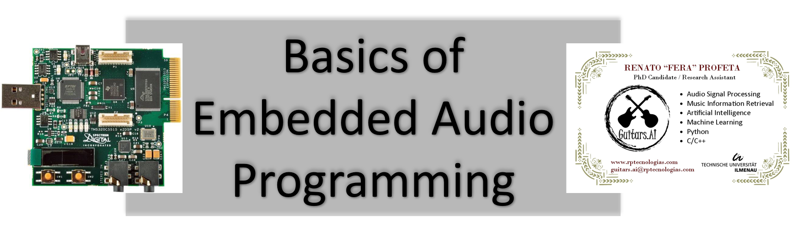

# Basics of Embedded Audio Programming   Notebooks and Tutorials

    

## Renato Profeta   PhD Candidate / Researcher
[Guitars.AI](https://www.instagram.com/guitars.ai/)

# Content
- 01 Hardware:  

  - Board Overview (TMS320C5515 eZdsp USB Stick)
  - Block Diagram
  - Components
    - Digital Signal Processor (C5515)
        - Fixed- vs. Floating- Point Devices
        - Bit-Depth or Data Width
        - JTAG Interface
    - Audio Codec (TLV320AIC3204)
        - I²C (Inter-integrated Circuit)
        - I²S (Inter-integrated Circuit Sound)

- "Hello World": Audio Loopback from Stereo Line IN to Lineout OUT:  

  - Code Composer Studio IDE (Integrated Development Environment)
    - C5500 Compiler
  - CCS Project
    - Project Properties
    - Build Project
    - Debug Project
    - Terminate Program

- Audio CODEC Configuration:  

  - Audio CODEC Block Diagram
  - ADC Gain Setting
    - Programmable Gain Amplifier (PGA) f
  - Sampling Rate Configuration
    - Phase-locked Loop (PLL)

# YouTube Playlist

 
# Requirements
Please check the following files at the 'binder' folder:
  - environment.yml
  - postBuild

# COMING SOON - UNDER CONSTRUCTION
https://github.com/GuitarsAI/BEAP_Tutorials/blob/master/beap_01_board.ipynb
